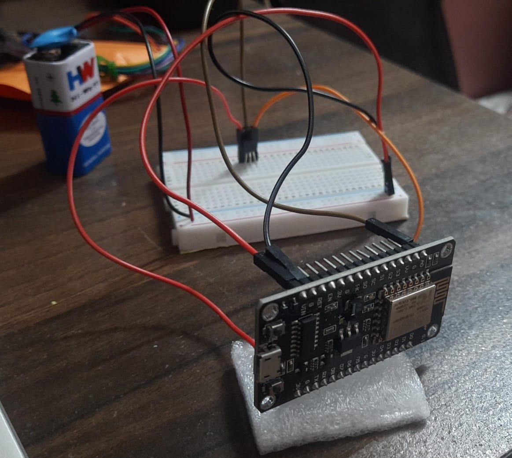

# LM 35 ThinkSpeak Server Temperature Reading

### Here by Using NodeMCUESP8266 & LM35 Tempearature Sensor &  Cloud Service Like ThinkSpeak we can Read the Tempearture Collected by the LM35  & show it in the ThinkSpeak Console.

## Working Circuit :

## Think Speak Console :

## Components Required :

<ul>
<li>NodeMCU ESP8266</li>
<li>LM35</li>
<li>Wire (Male-Male,Male-Female)</li>
<li>9v Battery</li>
<li> USB Cabel </li>
</ul>